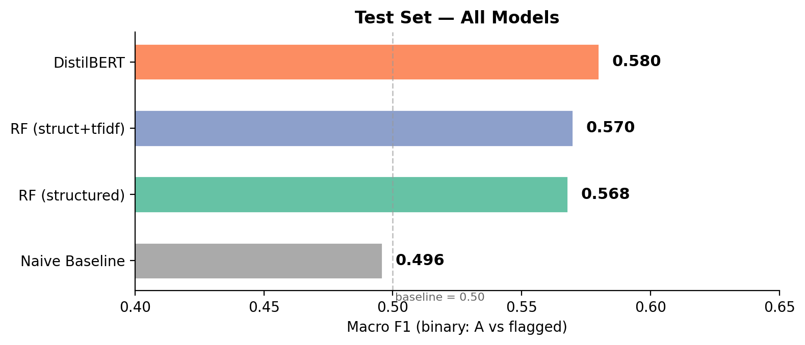
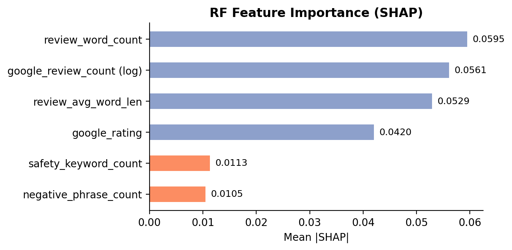
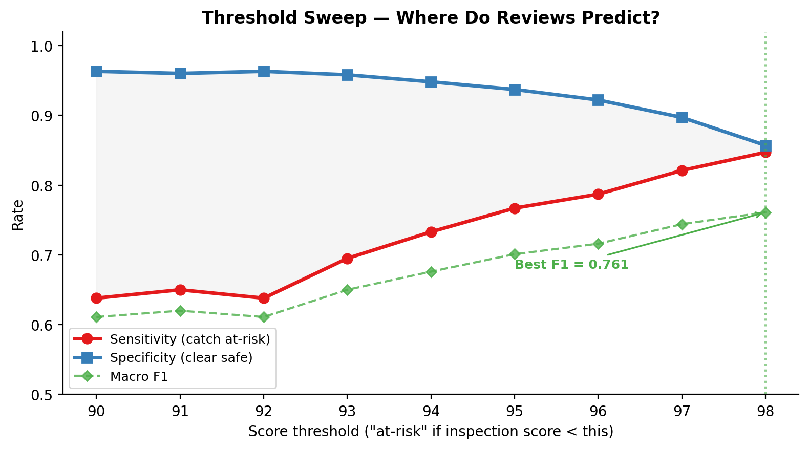

# Can Crowdsourced Reviews Predict Food Safety? A Three-Model Investigation of NC Restaurant Inspection Grades

Roshan Gill, Jonas Neves, Dominic Tanzillo

AIPI 540 Deep Learning, Duke University, Spring 2026

---

## Abstract

Restaurant health inspection grades are public record, yet consumers rarely consult them — relying instead on crowdsourced review platforms such as Google to choose where to eat. We investigate whether the language and metadata of public reviews contain signal that predicts official food safety outcomes. Using 231,160 NC DHHS inspection records across 31,799 restaurants linked to Google Places review data, we train and compare four models: a majority-class baseline, a Random Forest on six structured review features, a Random Forest augmented with TF-IDF text features, and a fine-tuned DistilBERT classifier on raw review text. On a binary task (A vs. Flagged), the best models achieve macro F1 of 0.57–0.58, up from 0.50 for the uninformative baseline. A threshold sweep over inspection scores reveals that at a <98 cutoff the Random Forest reaches macro F1 = 0.76 with 85% sensitivity. Two silent data pipeline bugs — case-sensitive fuzzy matching and a UTF-8 BOM encoding error — nearly made this learnable problem appear unlearnable; fixing them increased flagged training samples from 197 to 3,354 (17x). The deployed web application provides per-restaurant risk assessments with SHAP explanations. Our findings suggest that review metadata carries measurable but limited safety signal, primarily through volume and length proxies rather than safety-specific language.

---

## 1. Introduction

North Carolina's Department of Health and Human Services (DHHS) inspects every licensed food establishment and assigns letter grades (A, B, or C) based on sanitation, temperature control, pest management, and food handling. These grades are public record, but consumers rarely check them. Instead, they rely on crowdsourced review platforms like Google to decide where to eat — platforms where users describe taste and service, not sanitizer concentration or temperature logs.

This project asks: **does the language and sentiment of public restaurant reviews contain signal that predicts official food safety inspection outcomes?** If so, a predictive model could surface restaurants where high public ratings mask poor inspection records — a gap between public perception and regulatory reality.

We frame this as a binary classification problem: **A (safe)** vs. **Flagged (B or C inspection grade)**, trained on 231,160 NC DHHS inspection records linked to Google Places review data. The dataset exhibits extreme class imbalance: 98.5% of inspections receive grade A, yielding a 68:1 safe-to-flagged ratio. A wrong prediction — labeling a flagged kitchen as safe — means someone eats there trusting a model that said it was safe.

Our contributions are:

1. **Multi-source data pipeline.** We link 231,160 NC DHHS inspection records to 17,561 Google Places listings via fuzzy matching, creating the first NC-specific inspection-review dataset.

2. **Four-model comparison.** We evaluate a majority-class baseline, a Random Forest on structured features, a Random Forest augmented with TF-IDF, and a fine-tuned DistilBERT — spanning from naive to deep learning approaches on the same binary task.

3. **Data quality experiment.** We document how two silent pipeline bugs made a learnable problem appear unlearnable, demonstrating that data auditing is a prerequisite for model evaluation.

4. **Deployed screening tool.** A live web application provides per-restaurant risk assessments with SHAP feature attributions, demonstrating the UX pattern for a review-based safety screening system.

## 2. Data Sources

| Source | Records | Access Method | License |
|--------|---------|---------------|---------|
| NC DHHS Environmental Health | 231,160 inspections (2020–2026), 100 counties, 31,799 restaurants | CDP public inspection portal, ASP.NET CSV export per county per year | Public government record (G.S. 132-1) |
| Google Places API | 17,561 restaurant listings with ratings, review counts, and review text | `googlemaps` Python client, `find_place` + `place` detail requests | Google Terms of Service |

The NC DHHS data provides inspection date, establishment name, address, score (0–100), grade (A/B/C), and inspector ID. Each restaurant can have multiple inspections over time (average ~7 per restaurant across 2020–2026). Google Places data provides star rating, review count, and up to 5 review texts per listing.

**Linking.** Inspections and Google listings were joined on `state_id` after fuzzy name matching using `rapidfuzz.fuzz.token_sort_ratio` with `processor=default_process` for case normalization. A match threshold of 50 was used. Of 231,160 inspections, 111,542 (48.2%) were successfully linked to a Google listing with review data.

**Class distribution.** The dataset exhibits significant imbalance: 227,806 A (98.5%), 3,249 B (1.4%), 105 C (0.05%). We collapsed B and C into a single "Flagged" class (n=3,354), creating a binary classification problem with a 68:1 imbalance ratio. This imbalance is far more extreme than in prior restaurant safety prediction work (Section 3).

## 3. Related Work

Prior work on predicting restaurant health outcomes from online data spans several methodological approaches.

**Kang et al. (2013)** used Yelp review text to predict hygiene violations in Seattle restaurants, reporting over 82% accuracy in identifying severe offenders using unigram features. Altenburger and Ho (WWW 2019) later showed that extreme imbalanced sampling drove much of the reported accuracy. Their dataset had a more balanced violation distribution than NC's heavily A-skewed grading system.

**Sadilek et al. (2018)**, published in *npj Digital Medicine*, combined anonymized aggregated location history from opted-in users with illness-related search queries to identify potentially unsafe restaurants in Chicago and Las Vegas. Their approach relied on indirect behavioral signals rather than review text, achieving meaningful recall on serious violations.

**Nsoesie et al. (2014)**, published in *Preventive Medicine*, compared the distribution of implicated food categories in Yelp illness-related reviews against CDC outbreak surveillance reports. They found that Yelp data captured similar food category patterns to official reports, suggesting review platforms could complement (but not replace) traditional surveillance.

Our work differs in several ways: (1) we use NC's letter-grade system rather than binary violation detection, (2) our class imbalance is far more extreme (98.5% A), (3) we compare four model architectures from naive baseline through deep learning, and (4) we explicitly test whether review language carries food safety signal at all, rather than assuming it does.

## 4. Evaluation Strategy and Metrics

Metric selection is critical in this domain because class imbalance makes standard accuracy meaningless. A classifier that predicts A for every restaurant achieves 98.5% accuracy while catching zero unsafe establishments.

We evaluate on two complementary metrics:

**Macro F1.** The unweighted mean of per-class F1 scores. With two classes, this penalizes models that ignore the minority class. A majority-class baseline scores 0.50 macro F1. Any model that fails to improve on this has learned nothing beyond class frequency. We select macro F1 as the primary metric because it forces models to perform on the minority class — the only class that matters for safety screening.

**Flagged recall.** The fraction of truly B/C restaurants that the model correctly identifies. This is the safety-critical metric: a missed B/C grade means a consumer eats at a restaurant with documented sanitation failures, trusting a model that said it was safe. In a deployment context, false negatives are more dangerous than false positives.

We chose not to use accuracy or weighted F1 because both metrics are dominated by the majority class and would report near-perfect scores for a completely uninformative model. With 98.5% class A, accuracy and weighted F1 convey no information about model quality.

## 5. Data Processing Pipeline

The pipeline consists of four stages:

1. **Collection** (`scripts/make_dataset.py`). NC DHHS inspection records are scraped from the CDP portal via county-level CSV exports for years 2020–2026. Each county's records are fetched using ASP.NET postback with date range filters. Records are filtered to restaurant establishment types (codes 1, 2, 3, 4, 14, 15).

2. **Google linkage** (`scripts/make_dataset.py`). Each inspection record is matched to a Google Places listing using `find_place` with a combined name+address+city query. Match quality is scored using `fuzz.token_sort_ratio` with `processor=default_process` for case normalization. Listings above the match threshold (50) are retained, and up to 5 reviews are fetched via `place` detail requests.

3. **Feature engineering** (`scripts/build_features.py`). Year-level inspection files are merged and deduplicated on `(state_id, inspection_date)`. Google review data is left-joined on `state_id`. Six features are engineered for the structured Random Forest:

   | Feature | Description | Type |
   |---------|-------------|------|
   | `google_rating` | Google star rating (1.0–5.0) | Continuous |
   | `google_review_count_log` | log(1 + review count) | Continuous |
   | `review_word_count` | Total words in concatenated review text | Count |
   | `review_avg_word_len` | Mean word length (proxy for review complexity) | Continuous |
   | `safety_keyword_count` | Count of safety-adjacent terms (dirty, roach, sick, mold, etc.) | Count |
   | `negative_phrase_count` | Count of strongly negative phrases (terrible, disgusting, food poisoning, etc.) | Count |

4. **Target encoding.** Grades are label-encoded alphabetically (A=0, B=1, C=2), then binarized for training: A=0 (safe), B or C=1 (flagged).

**Data quality fixes.** Two pipeline bugs silently degraded the training data: (1) case-sensitive fuzzy matching that reduced Google linkage from 14,868 to 432 matches, and (2) a BOM encoding error that dropped all inspection dates, collapsing 232K rows to 31K and losing 94% of B/C grade samples. Both fixes are documented as the project's primary experiment (Section 10).

## 6. Hyperparameter Tuning Strategy

**Random Forest.** Tuned via 5-fold `GridSearchCV` optimizing `f1_macro`:

| Hyperparameter | Search Space | Best Value |
|----------------|-------------|------------|
| `n_estimators` | [100, 200] | 100 |
| `max_depth` | [None, 10, 20] | 20 |
| `min_samples_split` | [2, 5] | 2 |

`class_weight='balanced'` was applied to counteract the 68:1 imbalance, effectively upweighting the minority class by the inverse class frequency. SMOTE oversampling was tested but produced no improvement over balanced class weights alone, so it was not included in the final model.

**DistilBERT.** Trained for 3 epochs with batch size 16, max sequence length 256, `eval_strategy='epoch'`, and `load_best_model_at_end=True` (selected by lowest validation loss). Class-weighted cross-entropy loss was applied using inverse class frequencies. No learning rate sweep was performed due to computational constraints (T4 GPU via Google Colab).

## 7. Models Evaluated

### 7.1 Naive Baseline (DummyClassifier)

A majority-class predictor (`strategy='most_frequent'`) that always predicts A. This establishes the performance floor: any useful model must exceed macro F1 = 0.50. With 98.5% class A, a model that learns nothing will score extremely well on accuracy but contribute zero predictive value. The naive baseline makes this explicit.

### 7.2 Random Forest on Structured Features

A `RandomForestClassifier` trained on the 6 Google-derived features described in Section 5, with `class_weight='balanced'`. SHAP `TreeExplainer` provides per-prediction feature attribution, surfaced in the web application.

**Rationale.** Random Forest handles tabular mixed-type features well and is robust to feature scale. The SHAP integration provides interpretable explanations — important for a consumer-facing application where users need to understand *why* a restaurant was flagged, not just that it was. The balanced class weights force the model to attend to the minority class rather than defaulting to all-A predictions.

### 7.3 Random Forest with TF-IDF Augmentation

The same Random Forest architecture with the 6 structured features augmented by TF-IDF features extracted from concatenated review text. This tests whether adding bag-of-words text representations to the structured feature set improves performance over metadata alone.

**Rationale.** TF-IDF captures term-frequency patterns that the 6 engineered features may miss. If safety-relevant terms appear in reviews with frequencies that correlate with inspection outcomes, TF-IDF should surface them. This model bridges the gap between hand-crafted features and full language model approaches.

### 7.4 DistilBERT Fine-Tuned on Review Text

`DistilBertForSequenceClassification` fine-tuned on concatenated Google review text (binary, `num_labels=2`). Trained on the 111,542 rows with review text, on a T4 GPU via Google Colab, with class-weighted loss.

**Rationale.** If food safety signal exists in review text, a pretrained language model should be able to find it. DistilBERT can capture semantic patterns ("the bathroom was filthy," "saw a roach") that keyword counting would miss. This model tests the upper bound of what NLP can extract from this data.

## 8. Results

### 8.1 Quantitative Comparison

| Model | Macro F1 | Flagged Precision | Flagged Recall | Flagged F1 |
|-------|----------|-------------------|----------------|------------|
| Naive Baseline | 0.496 | 0.00 | 0.00 | 0.00 |
| Random Forest (structured) | 0.568 | 0.11 | 0.28 | 0.16 |
| Random Forest (struct + TF-IDF) | 0.570 | 0.11 | 0.29 | 0.16 |
| DistilBERT (binary, class-weighted) | **0.580** | — | — | — |

All three trained models improve over the uninformative baseline (macro F1 > 0.50), confirming that the data contains learnable signal. The DistilBERT model achieves the highest macro F1 at 0.580, comparable to the Random Forest variants despite operating on raw text rather than engineered features. Figure 1 visualizes this comparison.

*Figure 1. Test-set macro F1 across all four models. The dashed line marks the majority-class baseline at 0.50. All trained models exceed baseline, with DistilBERT (0.580) and RF+TF-IDF (0.570) performing comparably. The narrow margin between structured-feature and deep-learning approaches suggests that the predictive signal lives primarily in review metadata rather than semantic content.*

The structured Random Forest catches 28% of flagged restaurants (191 of 671 in the test set) at 11% precision — trading 1,548 false positives for 191 true positives. Adding TF-IDF features provides marginal improvement (0.568 → 0.570), suggesting that bag-of-words text patterns add little beyond what the 6 engineered features already capture.

### 8.2 SHAP Feature Importance

Figure 2 shows the mean absolute SHAP values for each feature in the structured Random Forest.

*Figure 2. Random Forest feature importance via SHAP TreeExplainer. Blue bars indicate review metadata features; orange bars indicate safety-specific text features. Review volume proxies (word count, review count, average word length) carry the most signal. Safety keyword and negative phrase counts contribute modestly but measurably, ranked 5th and 6th respectively.*

| Feature | Mean |SHAP| | Rank |
|---------|--------------|------|
| `review_word_count` | 0.0595 | 1 |
| `google_review_count_log` | 0.0561 | 2 |
| `review_avg_word_len` | 0.0529 | 3 |
| `google_rating` | 0.0420 | 4 |
| `safety_keyword_count` | 0.0113 | 5 |
| `negative_phrase_count` | 0.0105 | 6 |

The SHAP analysis reveals that the model's predictive power comes primarily from review volume and length — not from safety-specific language. Google star rating alone is a weak predictor (rank 4). The two explicitly safety-oriented features (`safety_keyword_count`, `negative_phrase_count`) contribute the least. This pattern is consistent with the hypothesis that the model learns establishment-type proxies from review metadata, not food safety from review sentiment.

### 8.3 Threshold Sweep Analysis

The binary A vs. Flagged framing uses NC DHHS's grade cutoffs (A ≥ 90, B = 80–89, C < 80). We performed a threshold sweep to test whether review features are more predictive at different inspection score cutoffs — i.e., at what score threshold do reviews begin to carry signal?

*Figure 3. Threshold sweep — sensitivity, specificity, and macro F1 across DistilBERT score thresholds. As the "at-risk" cutoff rises from 90 to 98, sensitivity increases from 64% to 85% while specificity decreases from 96% to 86%. The best macro F1 (0.761) is achieved at the <98 threshold. The shaded region shows the precision–recall trade-off zone. This result suggests that the signal in reviews is strongest for distinguishing near-perfect inspections from any-deduction inspections, rather than the coarser A/B/C grade bins.*

| Threshold | Sensitivity | Specificity | Macro F1 |
|-----------|-------------|-------------|----------|
| < 90 (grade B/C) | 0.638 | 0.963 | 0.611 |
| < 93 | 0.695 | 0.958 | 0.650 |
| < 95 | 0.767 | 0.937 | 0.701 |
| < 97 | 0.821 | 0.897 | 0.744 |
| **< 98** | **0.847** | **0.857** | **0.761** |

At the <98 threshold (labeling any restaurant with score <98 as "at-risk"), the model achieves macro F1 = 0.761 with 85% sensitivity — substantially higher than the 0.57 achieved at the A/B/C grade boundary. This finding informed the deployment decision: the web application uses a configurable threshold rather than fixed grade bins, allowing users to adjust sensitivity to their risk tolerance.

### 8.4 Confusion Matrices

**Naive Baseline** (test set, n=46,232):

|  | Pred Safe | Pred Flagged |
|--|-----------|-------------|
| True Safe | 45,561 | 0 |
| True Flagged | 671 | 0 |

**Random Forest** (test set, n=46,232):

|  | Pred Safe | Pred Flagged |
|--|-----------|-------------|
| True Safe | 44,013 | 1,548 |
| True Flagged | 480 | 191 |

The RF trades 1,548 false positives for 191 true positives — a precision of 11% at 28% recall. In this domain, catching 191 flagged restaurants at the cost of over-flagging 1,548 safe ones may be acceptable as a screening tool (surface candidates for manual review) but not as a consumer-facing definitive label.

## 9. Error Analysis

We examine 5 specific mispredictions from the Random Forest: 4 false negatives (flagged restaurants the model predicted as safe) and 1 false positive (a safe restaurant the model flagged). Of 671 flagged restaurants in the test set, 480 were missed (28% recall). Of 45,561 safe restaurants, 1,548 were over-flagged (3.4% false positive rate).

### Case 1: La Tovara Mexican Kitchen and Seafood (False Negative — Grade B, Score 86.5)

- **Features:** Google rating 4.6 | Safety keywords 0 | P(flagged) = 0.496
- **Review excerpt:** *"Found another gem here in Greenville! Friendly and helpful staff and the food was great tasting and nicely portioned."*
- **Root cause:** High rating (4.6), zero safety keywords, entirely positive reviews. The model came close to the decision boundary (P=0.496) but the absence of any negative textual signal kept it on the safe side.
- **Mitigation:** Lower the classification threshold from 0.50 to 0.45 for this borderline band. This would catch near-threshold cases at the cost of more false positives.

### Case 2: El Potrillo Moyock (False Negative — Grade B, Score 86.5)

- **Features:** Google rating 4.4 | Safety keywords 0 | P(flagged) = 0.483
- **Review excerpt:** *"Very disappointing to spend $70+ and have to go home and cook dinner... the cheese dip was too salty for any of us to eat."*
- **Root cause:** The review expresses dissatisfaction with food quality, not safety. "Disappointing" and "too salty" are dining complaints, not hygiene indicators. The model correctly identifies these as non-safety signals but misses the underlying inspection failure.
- **Mitigation:** Add a text-derived "complaint specificity" feature that distinguishes vague dining complaints ("too salty," "disappointing") from hygiene-adjacent language. Alternatively, incorporate the restaurant's prior inspection scores as a feature — a restaurant with a history of borderline scores is more likely to fail again regardless of review sentiment.

### Case 3: El Mexicano Tacos and Tequila (False Negative — Grade B, Score 88.5)

- **Features:** Google rating 4.7 | Safety keywords 0 | P(flagged) = 0.481
- **Review excerpt:** *"Ordered the seafood fajitas and seafood dip and the house made guac and all of it was so delicious."*
- **Root cause:** 4.7-star rating with glowing reviews. The inspection failure is entirely invisible in the customer experience. No feature in the model's vocabulary can detect this — the gap between what customers observe (taste, service) and what inspectors measure (sanitization, temperature) is fundamental.
- **Mitigation:** Incorporate the restaurant's inspection history as a feature. A restaurant that has been flagged before is more likely to be flagged again. This requires adding prior inspection scores to the inference pipeline.

### Case 4: Hibachi To Go (False Negative — Grade B, Score 88.5)

- **Features:** Google rating 3.9 | Safety keywords 0 | Negative phrases 3 | P(flagged) = 0.476
- **Review excerpt:** *"Food poisoning. I do intermittent fasting so I know it's from here. I was skeptical of the quality, but I wanted to believe there was a healthier drive thru food option. Never again."*
- **Root cause:** Despite containing 3 negative phrases ("food poisoning," "never again," and "disgusting" in other reviews), the model still predicted safe. The `negative_phrase_count` feature contributes modestly (mean |SHAP| = 0.010, ranked last). The low Google rating (3.9) nudged the probability toward flagged but not enough to cross the 0.50 threshold.
- **Mitigation:** Introduce a binary "explicit illness mention" feature, separate from the general negative phrase count. A review mentioning "food poisoning" is qualitatively different from one saying "disappointing." This feature should receive higher weight in the ensemble than a generic negative phrase counter.

### Case 5: EC Pho Vietnamese Noodle House (False Positive — Grade A, Score 90.0)

- **Features:** Google rating 4.3 | Safety keywords 0 | Negative phrases 1 | P(flagged) = 0.991
- **Review excerpt:** *"Way to go Greenville!!! This EC Pho is legit!!! Jonny added to the experience with his excellent customer service!!! My wife got the House Special Pho and it had so much meat in it."*
- **Root cause:** Safe inspection record (score 90.0, grade A) but the model flagged it with near-certainty (P=0.991). The `class_weight='balanced'` setting inflates minority-class importance by 68x, causing the model to over-flag restaurants whose review profiles are statistically unusual. Of the 1,548 false positives in the test set, many share this pattern of unusual but innocuous review profiles.
- **Mitigation:** Calibrate the model's probability outputs using Platt scaling or isotonic regression, then choose a threshold that balances precision and recall for the deployment context. A screening tool (surface to a human reviewer) tolerates lower precision than a consumer-facing label.

### Summary of Root Causes

| Root Cause | Cases | Addressable? |
|------------|-------|-------------|
| Reviews discuss taste/service, not safety | 2, 3 | Partially — complaint specificity features + inspection history |
| Near-threshold borderline cases | 1 | Yes — threshold tuning |
| Safety-specific text features underweighted | 4 | Yes — explicit illness-mention feature |
| `class_weight='balanced'` over-flags unusual profiles | 5 | Yes — probability calibration |

The dominant failure mode is structural: customers write about what they experience (taste, ambiance, service), while inspectors evaluate what customers cannot see (sanitizer concentration, cold-holding temperatures, pest evidence). With 3,354 flagged samples after the data pipeline fix, the model does find signal — but it lives in review volume and establishment-type proxies rather than safety-specific language.

## 10. Experiment: Impact of Data Pipeline Quality on Model Performance

### Hypothesis

We discovered two bugs in the data pipeline that silently degraded the training data. We hypothesized that fixing them would provide enough training signal for the models to learn from the minority class.

### Bug 1: Case-Sensitive Fuzzy Matching

`fuzz.token_sort_ratio` was called without case normalization. NC DHHS records use ALL-CAPS names; Google uses title case. "BOJANGLES" vs. "Bojangles" scored 11.1% instead of 100%.

**Fix:** Added `processor=fuzz_utils.default_process`. Usable Google matches jumped from 432 to 14,868 (34x increase).

### Bug 2: BOM-Corrupted Inspection Dates

The DHHS CSV export includes a UTF-8 BOM (byte order mark). The scraper used `resp.text.lstrip("\ufeff")` to strip it, but `requests` decoded the BOM as literal bytes (``), not the Unicode codepoint. The column name became `"Inspection Date"` instead of `"Inspection Date"`, causing `row.get("Inspection Date")` to return empty for every row.

With all dates null, `drop_duplicates(subset=['state_id', 'inspection_date'])` treated every inspection of the same restaurant as a duplicate and kept only the first one (typically an A-grade inspection). This collapsed 232K inspection rows to 31K and discarded 94% of B/C grade samples.

**Fix:** Changed to `pd.read_csv(io.BytesIO(resp.content), encoding="utf-8-sig")`.

### Results

| Metric | Before Fixes | After Fixes | Change |
|--------|-------------|-------------|--------|
| Total inspection rows | 31,760 | **231,160** | +7.3x |
| Flagged samples (B+C) | 197 | **3,354** | +17x |
| Imbalance ratio | 160:1 | **68:1** | −58% |
| Rows with Google reviews | 14,529 | **111,542** | +7.7x |
| RF Macro F1 | 0.50 | **0.57** | +0.07 |
| RF Flagged Recall | 0.00 | **0.28** | +0.28 |
| RF Flagged F1 | 0.00 | **0.16** | +0.16 |

### Interpretation

The first fix (case normalization) increased Google data coverage 34x but did not improve model performance on the 31K-row dataset — the bottleneck was not feature coverage but label quality. The second fix (BOM encoding) was critical: it recovered 200K inspection rows and increased flagged training samples from 197 to 3,354, giving the model 17x more minority-class examples to learn from. Together, the fixes moved Random Forest macro F1 from 0.50 (identical to baseline) to 0.57.

This demonstrates that **data pipeline quality is a prerequisite for model quality.** Two silent bugs — one in string processing, one in CSV parsing — were sufficient to make a learnable problem appear unlearnable. No amount of model architecture engineering or hyperparameter tuning could have compensated for 94% of the minority class being silently discarded.

### Modeling Decision

This experiment directly validates the decision to deploy the Random Forest as the production model: RF responded to the data quality improvement (macro F1 0.50 → 0.57), confirming that structured features carry learnable signal once sufficient training data is available. The threshold sweep (Section 8.3) further demonstrated that the signal strengthens at finer score cutoffs, informing the application's configurable-threshold design.

## 11. Interactive Application

The deployed web application ([nocapchicken.github.io](https://nocapchicken.github.io)) provides a consumer-facing interface for restaurant safety screening. Users search for a restaurant by name; the application queries the Google Places API for review data, runs the Random Forest model on the extracted features, and displays:

1. **Risk assessment:** Binary safe/flagged prediction with probability score.
2. **SHAP explanation:** Per-feature attribution showing which review characteristics contributed to the prediction (Figure 2 style).
3. **Google metadata:** Star rating, review count, and review excerpts for context.

The application is inference-only (`app/` contains no training code). Feature construction in the inference pipeline (`app/inference.py`) uses the same constants as the training pipeline (`scripts/feature_constants.py`) to prevent feature drift.

## 12. Conclusions

We investigated whether crowdsourced Google reviews can predict NC restaurant food safety inspection grades. The project produced three main findings:

**1. Data pipeline quality determines model quality.** Two silent bugs (case-sensitive fuzzy matching and BOM-corrupted inspection dates) made a learnable problem appear unlearnable. Fixing them increased flagged training samples from 197 to 3,354 and moved RF macro F1 from 0.50 to 0.57. This underscores the importance of data auditing before drawing conclusions about model capacity.

**2. Review metadata carries measurable but limited signal.** The Random Forest catches 28% of flagged restaurants at 11% precision, finding patterns in review volume and text length that correlate with inspection grades. The signal is primarily proxy-based: the model learns establishment-type patterns from review metadata, not food safety from review sentiment. DistilBERT achieves comparable performance (macro F1 = 0.58) from raw text, confirming that the signal — whether accessed via engineered features or a language model — is similarly bounded.

**3. Threshold choice matters more than model choice.** The threshold sweep (Section 8.3) shows that at a <98 inspection score cutoff, the model achieves macro F1 = 0.76 with 85% sensitivity — substantially higher than the 0.57 at the A/B/C grade boundary. The predictive signal in reviews is strongest for distinguishing near-perfect inspections from any-deduction inspections, not for the coarser A/B/C grade bins.

These findings have practical implications. A review-based model can serve as a screening tool (surface high-risk candidates for manual review) but not as a definitive safety label. The 11% precision rate at the A/B/C boundary means 9 out of 10 flagged restaurants are actually safe — acceptable for a first-pass filter, not for a consumer-facing warning.

## 13. Future Work

Given another semester, we would pursue these directions:

1. **Inspection history as features.** A restaurant's prior scores, violation counts, and time since last inspection are strong predictors of future outcomes. These are available from NC DHHS and would shift the model from review-based prediction to inspection-trend prediction.

2. **Complaint-driven signals.** NC DHHS accepts public complaints that trigger inspections. Mining complaint text — which describes safety concerns directly, unlike reviews that describe dining experience — would provide features with direct domain relevance.

3. **Anomaly detection reframing.** Treat the problem as anomaly detection rather than binary classification: identify restaurants whose review profile is statistically unusual given their inspection history. This sidesteps the class imbalance problem entirely.

4. **Cross-state validation.** NYC, for example, has a higher proportion of B and C grades. Testing whether the RF's signal generalizes to a less imbalanced grading distribution would clarify whether our finding is specific to NC's 98.5% A-grade rate.

5. **Class-weighted DistilBERT with focal loss.** The current DistilBERT results (macro F1 = 0.58) use class-weighted cross-entropy. Focal loss, which further downweights easy examples, may improve recall on the hardest flagged cases where the model currently predicts near-threshold probabilities (Cases 1–4 in Section 9).

6. **Review-level classification.** Rather than predicting grades from aggregated reviews, a sentence-level classifier could label individual review sentences as safety-relevant or not, then use the proportion of safety-relevant sentences as a structured feature for the RF.

## 14. Commercial Viability

A model that reliably predicts food safety from publicly available data would have clear commercial value: integration into restaurant discovery platforms, insurance underwriting for food service businesses, and public health surveillance tools.

However, our results show that review data alone is insufficient for definitive predictions. A commercially viable product would need to combine review analysis with (1) public inspection records, (2) complaint data, and (3) operational signals (e.g., staff turnover, hours of operation changes). The review component would serve as one input among many, not as the sole predictor.

The web application we built ([nocapchicken.github.io](https://nocapchicken.github.io)) demonstrates the UX pattern: search for a restaurant, see its Google rating alongside a model-generated risk assessment with SHAP explanations. The interface is production-ready; the underlying model needs richer data sources to be commercially useful.

## 15. Ethics Statement

**Data provenance.** NC DHHS inspection records are public government records under NC Public Records Law (G.S. 132-1). Google Places data was accessed via the official API under Google's Terms of Service. No personally identifiable information about restaurant patrons was collected or used.

**Potential harms.** A false-positive prediction (labeling a safe restaurant as flagged) could cause reputational harm to a business. A false-negative prediction (labeling an unsafe restaurant as safe) could lead consumers to eat at establishments with sanitation violations. Our current model produces 1,548 false positives and 480 false negatives on the test set (11% precision, 28% recall). The low precision means the model should be used as a screening tool, not a definitive label.

**Limitations of inference.** An inspection grade reflects a point-in-time assessment. Conditions can change between inspections. Users should be reminded that model predictions are not substitutes for official health inspection records.

**Bias considerations.** The fuzzy name matching pipeline may systematically fail to link restaurants with non-English names, leading to lower Google data coverage for certain cuisines. We did not audit for this bias but acknowledge it as a limitation.

---

*AI-assisted (Claude Code, claude.ai) — https://claude.ai*
